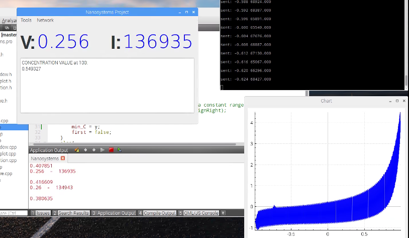

# Nanosystem-project
Voltametry reading project for the Nanosystem 2016 - 2017 course

The project consisted on developing an interface with Qt Creator(C++) that had to be running on a Raspberry PI 3 
and was able to parse voltammetry readings from a [biosensor](https://en.wikipedia.org/wiki/Biosensor).

The biosensor was simulated by an FPGA and the Raspberry PI had to interact via ethernet.
The program includes calibration, connection and data visualization.

